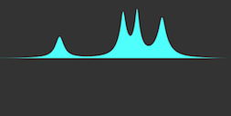
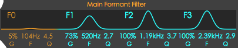
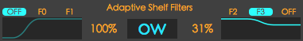
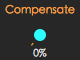

This is the user manual for Align-IT.  
Align-IT is a property of Studio 427 Audio, copyright 2021.  

For more information on our products, please visit [studio427audio.com](https://www.staging.studio427audio.com)

All trademarks cited in this document are the property of their respective owners, hence, cannot be associated with Studio 427 Audio by any means

___

## Welcome to Align-IT!

Thank you for choosing Studio 427 Audio.  
Here you will find all the information necessary for measuring the delay time of your venue.

[Awesome Link](b_registration)

## What is Align-IT?

Align-IT is a measurement tool that will report the delay of your different speakers regarding to a reference.

It is as simple as connecting a microphone, record the different speakers, and wait for Align-IT to compute the resulting delays.

There are many tools on the market for achieving the calibration of a venue. Although, most of the time you only want a quick and affordalble solution for a simple calculation of the delays and a spectogram visualisation. Align-IT is made for you in the situations where time is a key factor.

## What Align-IT proposes:

- Record and compute delay times between speakers.
- Spectral visualisation.
- 3 types of noise generated to adapt to any environment *(outdoor venue, reverberating hall, etc...)*.
- Compensation of the temperature between the time of measurement and during the show.
- Filter low frequency noises when recording.
- Adapts to lighter CPU via Selection length and Precision controls for quicker computation.
- Unit customisation Metric/Imperial and Celsius/Fahrenheit.
- Export the result as Screenshot *(.png)*, Text *(.txt)*, or comma separated file *(.csv)* so you have multiple ways to bring the results to your processors.
- No need for specific calibration microphone, any reference you have at hand will do *(accurate spectrum measure still requires an adapted microphone)*

___

In order to unlock Align-IT, you first need to activate your computer using the S427 Control Center.

In the Control Center app:

- Connect to your account
- Select Align-IT
- Select the license in the right panel
- Activate your computer
- Download/Install the icense file

Once this is done, you need to restart Align-IT to unlock.

## Register The Plugin

For registering your own version of the plugin:

- Enter your credentials.
- Enter the key license that you have received by email.
- Press enter.

Congratulations. You can now fully enjoy BlueMouth.

If you encounter any issue regarding your registration, please submit a ticket:
[Studio427 Audio](http://www.google.com)

## Demo Mode

The Demo Mode will give you a full access to BlueMouth functionnalities for 20 minutes, except that you will not be able to save your own presets.  
After a delay of 20 minutes, you will need to relaunch the plugin or register with Studio427 Audio to get your license

___

The main interest, I'd rather say the most funny part in using BlueMouth, is when you control the plugin from a MIDI keyboard and/or controller.  
For doing so, you will need to load the plugin differently regarding the DAW you are using. Simply placing the plugin in the FX chain of your audio source will not give you access to the ARP, Key To Formant, or CC modulation via MIDI.  
Sometimes, the best strategy is to load the plugin on a separated audio/aux track and use a MIDI track to send MIDI information to the plugin.

##  Ableton

Three Tracks:

##  Logic Pro

##  Pro Tools

Instrument Track:

  

>Hint: You can select multiple outputs with CTRL+Click

MIDI + Audio Track:

##  Cubase

##  FL Studio

##  Studio One

##  Reason

##  Reape

___

## The Ocular, the Eye, and the Mouth...

The three main controls on the interface are:

- The Formant selection wheel (Ocular)

- The Gender setting (Eye)

- The Intensity setting (Mouth)

>Hint: If you cannot move one of these parameters, this is probably due to the fact that it is already being modulated, or at least, is selected as target in the Modulation matrix of the Modulation page.

## The Formant Selection Wheel

The arrow simply allows to morph smoothly between the formants that are displayed around the wheel. 
Formants can be dragged to another place at will. 
A click on any formant directly sets the arrow straight thereon.  

## Loading more formant
By the mean of a right click on a formant, you have access to a wider choice of formant.  
In the popup, you can select fromant one by one to be inserted at the current select place on the wheel.  
Alternatively, you have the posibility to load a full set of formant at once.

## The Gender Parameter

The right eye is the Gender setting. The Gender setting changes the frequencies in the formant following the differences between a female and a male voice characteristics.

Each formant frequencies from F0 to F3 have different ratio applied in order to keep the gender characteristic and prevent from getting a simple pitch changing sensation.  

## The Intensity Parameter

It is possible to see the Mouth acting like a mix setting, although it is not. The Mouth applies different gains to the different frequencies, taking into account, for instance, the Rejection and the Shelve filters. 
Instead of mixing the raw sound with a fully pushed formant, it is a smooth gain transition of all the different filters combined.  

## Main CC Range

Each of the three controls have a CC Start & CC End setting.

- Small arrows for the Formant CC range

- Mars & Venus symbols for the Gender CC range

- Nostrils for the Intensity CC range

This CC Range determines how the 0-127 value of the incoming CC controls the parameter.  

>Hint: It is important to keep in mind that the mouse is not affected by the limits when moving a parameter. This is useful so you can still explore any setting outside these limits.

Changing CC Start or CC End will make the associated parameter to stick to the value you are actually setting. In other words, the parameter follows the new CC limit so you can quickly listen and fix the new value.

>Pro Tip: With a single click/drag on one CC limit knob, you can quickly set both Min & Max

## CC Link & CC Invert

The CC Link and the CC Invert buttons determine how the Formant or the Gender are linked to Intensity.

## Nose Q Setting

The Nose set the general Q ratio of all frequencies.
>Hint: Therefore, the Nose setting respects the formant F0-F3 original setting, only applying a ratio.

The default setting of the Q ratio is 100% (thin Nose), and corresponds to the original formant characteristic.

With a lower value, the Q diminishes, so the frequency bands become larger (thick Nose).

## Formant Smoothing

The Formant Smoothing setting allows a smoother transition/morphing between formants.  
A lower setting gives fast response time, where a higher value gives a slower response time.  
This setting affects the response of the formants for these scenario:

- Mouse movement
- CC controllers
- ARP
- Key To Formant

The Formant modulation has its own smoothing setting (Att & Rel)

>Hint: The Formant Smoothing setting on the main interface is repeated in the ARP as well as in the Key To Formant page.  => Moving one or the other as the same result.  Although, it is important to keep in mind that this setting is disengaged when modulating the Formant. In this case, the modulation matrix provides separated Attack & Release setting. When disengaging the modulation of the formant though, the main Smoothing setting is re-engaged automatically

___

## Filters action

Below is a representation of how the different filters are applied:

#### Formant:

#### Formant + Rejection:

#### Formant + Rejection + Shelves:

## Main Formant Filter

The Main Formant Filter allows for independent setting of the different characteristics of a formant. 
 
> Hint: The selected formant appears in the Adaptive Shelf Filter panel.  Ensure that you have selected the good formant in the formant wheel prior any modification. What your hear might not be what you see!

The Main Formant Filter is composed with the four frequencies that characterize a formant, from F0 to F3.

### F0

But this is not trully accurate. F0 corresponds, in fact, to the pitch of the voice. Therefore, it is not necessary for building a formant. Still, F0 can be, in some situation, useful to provide a stronger Gender on the source, although this greatly depends on the material.  

>Hint: F0 is a low frequency, care must be taken in order not to overload the mix.

### F1 & F2

F1 and F2 are the two main frequencies that are necessary so our brain can reconstruct the associated vowel.  

### F3

F3, for its part, helps to add a more realistic imprint. 

### Parameters

Each of the four formant frequencies have three parameters.

- Gain
- Frequency
- Q Factor

These three parameters don't have the same scope:

| Parameter | Setting scope |
| -- | ------ |
| Gain | Common to all formants |
| Frequency | Independent / per formant |
| Q | Independent / per formant |

## Adaptive Rejection Filter

The Adaptive Rejection Filter, or ARF, allows to attenuate the signal between the formant frequencies. 
It provides stronger formant imprint by removing "what is not formant" in the material. 
Please note that this is not necessarily a good option as your source can loose its original character. 
Medium setting in the ARF often gives best results.

The term Adaptive means that the frequencies that are cut, are always calculated to be in between those from the Formant Filter

- Between F0 & F1
- Between F1 & F2
- Between F2 & F3

## Adaptive Shelf Filters

As for the ARF, the Adaptive Shelf Filters follow the selected frequency.  
The selected formant frequency is kept intact, as the shelf is, in fact, outside of it.

> Hint: The shelf frequency is not the selected frequency itself, but everything that is above it for the HiShelf, or below for the LoShelf.

## Level Compensation

The gain applied to the formant frequencies can go high, very high...  
This means that a clipping can occur very quickly. 
This is essentially true if the audio source at the input already contains a lot of material in these frequencies.

This is why BlueMouth as been thouroughly designed to compensate for high levels and clipping, and even limit the output if necessary *(see Adaptive Limiter section below)*.

Although care has been taken to keep the signal as straight as possible, the result can change from one source to another.
The "Compensate" knob sets the output level when Intensity is higher than 0%.

>Set Intensity at 0 and remember the level.  Set intensity at 100% and try to match the previous level using the "Compensate" knob.

## Adaptive Limiter

The Adaptive Limiter is a powerful weapon against clipping.  
A smart Limitation will be applied to the Formant Frequency if it is going above -1dB, a bit like a dynamic equalizer.  
The Adaptive Limiter will scrutinze the Formant Frequencies so it is always ready if just one frequency is bursting, even when modulating.

The Adaptive Limiter Reduction level is shown in the Gain & Meters section.

> Hint: The Adaptive Limiter worth to be engaged all the time. The goal, obviously, being to keep it as quiet as possible by the mean of the different level settings, like Compensate, Gain, F0-F3, and the input source.

## Gain Control, Input, Output, and Reduction Meters

The Gain level helps to prevent clipping of the output.

> Hint: The Gain is situated before the Adaptive Limiter in audio the chain.

## Humanizer

Breathe life into BlueMouth.

The Humanizer subtly modulates the formant frequencies independently and randomly.  
This is especially powerful on long notes, or with slow modulation.

> Protip: we like it 3/4 up almost all the time :

___

## Save Preset

Allows you to save modification of the preset that is opened.

## More

The More button gives you access to the preset folder.  
`/Users/user/Library/Application Support/Studio427 Audio/Product/User Presets`

You can also Import or Export presets.

## Add

Add a new category folder, sub-category folder, or preset.

## Rename

Rename a category folder, sub-category folder, or preset.

## Delete

Delete a category folder, sub-category folder, or preset.

> In Demo Mode, you cannot Save, Add, Rename or Delete a preset

___

## Modulation Sources

There are 5 sources of modulation:

-1 Audio Envelope
-1 Random Oscillator
-3 Oscillators

### Envelope

The Envelope react to the audio present at the input of BlueMouth.

>Hint: This mode is ideal for Wah-Wah like effects.

| Parameter | Range |
| ---  | ----- |
|Level | 0-100% |
|Attack | 0 to 1-2sec (depends on the source) |
|Release | 0 to 1-2sec (depends on the source) |

### Random Oscillator

The Random modulator offers you 5 waveshapes, Sine, Triangle, Saw, Invert Saw, and Square.
Both the period and the value are randomized.

| Parameter | Range |
| ---  | ----- |
|Level | 0-100% |
|Speed | 0-100% |
|Shapes | Sine/Triangle/Saw/Invert Saw/Square|

### Oscillators

OSC1, OSC2, and OSC3 are identical.

| Parameter | Range |
| ---  | ----- |
|Rate  | 0.1 to 10Hz |
|Tempo | 1/1 to 1/64T|
|Shapes | Sine/Triangle/Saw/Invert Saw/Square|

## Modulation Targets

There are 4 modulation targets:

-Formant
-Intensity
-Gender
-Rejection Filter

> When enabling the Formant modulation, the ARP, or the Key To Formant mode are automatically disabled, and vice versa.

>Hint: to invert the polarity of the modulation, click on the associated [Plotter](/g_modulation#plotters).

## Modulation Matrix

The Matrix simply allows you to send any Modulation Source to any Target.

There are also Attack & Release settings per Target.

| Parameter | Range |
| ---  | ----- |
|Attack  | 0-2sec |
|Release | 0-2sec|

## Plotters

The Plotters give you a visual feedback of the Target modulation.

>Hint: The animations of the 4 target controls can be deactivated in the Setting page.

#### Offset

On the left of each plotter you can find the vertical offset control.

#### Polarity/Inversion

A click on a plotter invert the polarity of the modulation.

-Blue: Normal
-Orange: inverte

___

Once you have connected BlueMouth to a MIDI input (see [DAW Integration](/c_daw)) and activated the ARP, it will be triggered by any incoming MIDI note.

>Hint 1: Note that the labels are re-ordered following the Formant wheel order (Occular).
>Hint 2: The smoothing setting is linked to the [Formant Smoothing](/d_main_param#formant-smoothing).

## Mouse/Shortcuts

- Double-Click to reset
- Shift Double-Click to reset all
- Right-Click or CMD-Click to draw a line

## Controls

| Parameter | Range |
| ---  | ----- |
|Smooth | 0-100% |
|Steps | 1 to 32 |
|Swing | 0-100% |
|Speed | 1/1 to 1/32 (inc. Dotted & Triplets) |

## Shift

In the case you like the result of the Random action but you feel it is not in phase with the rythm, you have the possibility to shift the entire ARP by clicking the Left or Right arrows.

## Direction

The arrow in the middle lets you change the direction the ARP is playing.

>Protip: Cool if switched via CC (see [MIDI Learn](/j_midilearn))

___

![Key To Formant](/images/custom/keyToFormant.png

___

![MIDI Learn](/images/custom/midiLearn.png

___

